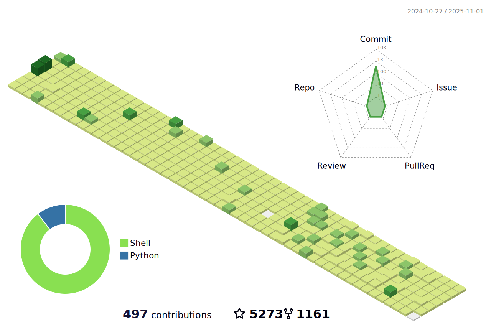

<!--   my-icons -->
<p align="center">
    <a href="https://github.com/BEPb/BEPb"></a>
    <a href="https://github.com/python/cpython"></a>
    <a href="https://github.com/BEPb/BEPb/graphs/contributors"></a>
    <a href="https://github.com/BEPb/BEPb/stargazers"></a>
    <a href="https://github.com/BEPb/BEPb/network/members"></a>
       
</p>

<!--   my-header-img -->

<a href="https://www.python.org/"></a>

<!--   my-ticker -->    
[](https://git.io/typing-svg)


<!--   my-kaggle     
### My achievements on [kaggle](https://www.kaggle.com/andrej0marinchenko):


-->


<!--   my-skils -->

| Property                                        | Data                                                                                                                                                                                                                                                                                                                                                                                                                                                                                                                                                                                                                                                                                                                                                                                                                                                                                                                                                                                                                                                                                                                                                                                                                                                                                                                                                                                                                                                                                                                                                                                                                                                                                                                                                                                                            |
|-------------------------------------------------|-----------------------------------------------------------------------------------------------------------------------------------------------------------------------------------------------------------------------------------------------------------------------------------------------------------------------------------------------------------------------------------------------------------------------------------------------------------------------------------------------------------------------------------------------------------------------------------------------------------------------------------------------------------------------------------------------------------------------------------------------------------------------------------------------------------------------------------------------------------------------------------------------------------------------------------------------------------------------------------------------------------------------------------------------------------------------------------------------------------------------------------------------------------------------------------------------------------------------------------------------------------------------------------------------------------------------------------------------------------------------------------------------------------------------------------------------------------------------------------------------------------------------------------------------------------------------------------------------------------------------------------------------------------------------------------------------------------------------------------------------------------------------------------------------------------------|
| **Language / IDE**                              |                                                                                                                                                                                                                                                                                                                                                                                                                                                                                                                                                                                                                                                                                                                                                                                                                                                                                                                                                                                                                                                                                                                                                                                                                                                                                                                                                                                                                                                                                                     |
| **Domain Knownledge**                           | [](https://github.com/BEPb/BEPb) [](https://github.com/search?q=user%3ABEPb&type=Repositories) [](https://github.com/search?q=user%3ABEPb&type=Repositories) [](https://github.com/search?q=user%3ABEPb&type=Repositories)                                                                                                                                                                                                                                                                                                                                                                                                                                                                                                                                                                                                                                                                                                                                                                                                                                                                                                                                                                                                                                                                                      |
| **CI / CD**                                     | [](https://github.com/BEPb/BEPb) [](https://github.com/BEPb/BEPb) [](https://github.com/BEPb/BEPb)                                                                                                                                                                                                                                                                                                                                                                                                                                                                                                                                                                                                                                                                                                                                                                                                                                                                                                                                                                                                                                                                                                                                                                                                                                                                                                                                                                                       |
| **Databases**                                   |                                                                                                                                                                                                                                                                                                                                                                                                                                                                                                                                                                                                                                                                                                                                                                                                                                                                                                                                                 |
| **OS**                                          | <a target="_blank" rel="noopener noreferrer" href="https://camo.githubusercontent.com/b44114213a5a462903bd69611bb6846f1dc41fe6f3230bd37c67c3d4eb65f08c/68747470733a2f2f696d672e736869656c64732e696f2f62616467652f2d57696e646f77732d626c61636b3f7374796c653d666c61742d737175617265266c6f676f3d77696e646f7773266c6f676f436f6c6f723d626c7565"></a> <a target="_blank" rel="noopener noreferrer" href="https://camo.githubusercontent.com/9c4bc049e33f41f122342a1714ccf872c34098a9f2c593c33c2322cf0129fa04/68747470733a2f2f696d672e736869656c64732e696f2f62616467652f2d5562756e74752d626c61636b3f7374796c653d666c61742d737175617265266c6f676f3d7562756e7475"></a>                                                                                                                                                                                                                                                                           |
| **Tools & Platform**                            |                                                                                                                                                                                                                                                                                                                                                                                                                                                                                                                                                                                                                                                                                                                                                                                                                                                                                                                                                                                                                                                                                                                                                                                                                                                                                                                                                                                               |
| **Machine Learning / Deep Learning frameworks** | ![Jupyter Notebook](http://img.shields.io/badge/-Jupyter%20Notebook-eee?style=flat-square&logo=data:image/png;base64,iVBORw0KGgoAAAANSUhEUgAAAA4AAAAQCAMAAAARSr4IAAACGVBMVEVhYmJdYWT/fBfzdyaqdlV2dnfcdC9udnz5dyKUaU3wdicCO2CzZzVdUkpOTk5MTk60ZzUAAP/XcC3fcivgciv/lArAajLqdSifYjrydyajnJjEjWifnp3FjGcAAACenp52dnd2dnd2dndhYmJhYmIxW3bzdybzdybzdybzdybzdyb/dxpydnl2dnd2dndhYmJgYmOda0r0dyXzdybzdybzdybudymQdmZldoJQYGmRaU7ydyfzdybzdybzdybzdybzdybzdybzdyb1dyX9dx/2dyXzdybzdybzdyb+eiPzdybzdybzdyb/ghz8eSQ3SFT/tABNTk5HTFBMTk5OTk5OTk5OTk5OTk5OTk5OTk5OTk5OTk5NTk5GTFBOTk5OTk5OTk5OTk5OTk5OTk5OTk5OTk5OTk5OTk5OTk5OTk5OTk5OTk5OTk5NTk5OTk5OTk5OTk5OTk5OTk5OTk5OTk5OTk5NTk5NTk5UUEx5WUMAOGRMTU9OTk5OTk5OTk5OTk5OTk5FTFAXQFvBajK8aTP2eCX0dyb0dyb0dybzdyb4eCXzdybzdybzdybzdybzdybzdybzdybzdybzdyb6dB3zdyXzdybzdybzdybzdybzdybzdybzdyaenp6cn6HKimD0dyXzdybzdybzdybzdybzdybzdyaenp6enp6dn6Dzdybzdyaenp6enp6enp6enp7zdyaenp7///9F1GYlAAAAsHRSTlMAAAAAAAAAAAAAAAAAAAAAAAAAAAAAAAAAAAAAAAAAADHCVho4Ax1RcnFOFz/ibFmwHXPc/thwKwkKJpfbqn1oaX+uighRdSIDAyV6TAQcAgIVHBMbKjIgEzBTHCsbLUBdQlhiTWBlR1xkaEVIR1tPbFEvF0pJNR9AFAQIMwgfKQUDBwgDBEsuMkcCLLSUKBsqT5iwNcX47N/g7cAxPmUqZq/OzaxiExPJYgQPCJjcP9lVnrgAAAClSURBVAjXVcyxSoIBAEXh+xkhEkFr6hD0AM5BkbQ3ODaEY4uDSENCS1BThI/h4v4TERG0NzZHvoAQ0SDV8FvkmS6cw5UgSTR5s83rlgUvWuA8l/Bs59eYbXhS28VdUt1H4dA9Eu1HexUdS3T/7Y81vXJ9rQicLcxoAK64hvd1fWwOeDgoy+JW3bCs56tOonnxd3ycGKt9nt7I91GShgn60yRJI/kBP8EfEEdOa6sAAAAASUVORK5CYII=&logoColor=F37626)    |

<!--   GitHub stats graph -->
### 📈 GitHub Activity Graph:
[](https://github.com/BEPb/github-readme-activity-graph)

| .                                                                                                                                       | .                                                                                                                         |
|-----------------------------------------------------------------------------------------------------------------------------------------|---------------------------------------------------------------------------------------------------------------------------|
|  |  |

</img>

<!--   profile-green-animate -->


<!--   grid-snake -->


<!--   skyline 
<a href="https://skyline.github.com/BEPb/2022"></a>
-->

<!--  2d history skills -->
</img>

**📫 How to Reach me:**
<p align="left">
<a href="https://twitter.com/noname85071193" target="blank"></a>
<a href="https://linkedin.com/in/andrej-marinchenko-0445b7214" target="blank"></a>
<a href="mailto:andrej.marinchenko@gmail.com" target="blank"></a>
<a href="https://api.whatsapp.com/send?phone=+375333333355" alt="Connect on Whatsapp">  </a>
</p>

<div align="center">
<summary>Trophy: Github Profile Trophy</summary>
</div>

<p align="center"> 
<a href="https://github.com/ryo-ma/github-profile-trophy"></a>
</p>


   <!--machine-learning-->
```mermaid
graph TD;
    machine-learning-->Data;
    machine-learning-->Algorithms;
    machine-learning-->Statistical-Models;
    machine-learning-->Feature-Engineering;
    machine-learning-->Evaluation-Metrics;
    machine-learning-->Deployment;
   ```
   
 


<div align="center">
<summary>Trophy: Hackerrank Profile Trophy</summary>
</div>

<p align="center"> 

 

</p>


<!-- coordinates Belarus - My Home-->
  
 ```geojson
{ "type": "Polygon", "coordinates": [ [[23.484127,53.912498], [23.527536,53.905702], [23.558199,53.897318], [23.589035,53.882919], [23.620357,53.871453], [23.655697,53.857623], [23.693463,53.845135], [23.729689,53.835216], [23.764804,53.825863], [23.793277,53.815301], [23.813078,53.806178], [23.829333,53.792928], [23.841056,53.777279], [23.846014,53.760332], [23.836441,53.74054], [23.825436,53.722233], [23.810049,53.704347], [23.793463,53.68682], [23.770393,53.669792], [23.747852,53.654714], [23.717919,53.641116], [23.681885,53.631819], [23.642556,53.627929], [23.601723,53.631323], [23.564348,53.640936], [23.528267,53.653311], [23.484127,53.662838], [23.440339,53.653287], [23.404237,53.64083], [23.364933,53.63126], [23.324122,53.628003], [23.284499,53.627126], [23.245336,53.628624], [23.20619,53.632489], [23.173835,53.641258], [23.138188,53.653814], [23.105862,53.670058], [23.077976,53.68778], [23.056857,53.705706], [23.042463,53.723305], [23.032198,53.742014], [23.027895,53.76094], [23.02966,53.778208], [23.038728,53.795653], [23.055158,53.811768], [23.076321,53.826044], [23.102277,53.838185], [23.132799,53.846784], [23.164262,53.855976], [23.196183,53.862356], [23.229304,53.870334], [23.263045,53.875969], [23.293063,53.881173], [23.321734,53.888048], [23.346643,53.898233], [23.367921,53.911319], [23.387006,53.925112], [23.400366,53.941051], [23.413914,53.957519], [23.424801,53.97426], [23.43253,53.99141], [23.438654,54.010816], [23.439642,54.029978], [23.439142,54.04913], [23.4375,54.068312], [23.432549,54.086731], [23.424433,54.105079], [23.414697,54.122446], [23.399568,54.139292], [23.378712,54.153666], [23.352773,54.165077], [23.325009,54.174164], [23.292276,54.179808], [23.258203,54.183447], [23.224348,54.187618], [23.189744,54.18904], [23.154946,54.192623], [23.121997,54.196646], [23.089521,54.199365], [23.055527,54.201235], [23.021396,54.201025], [22.987882,54.201996], [22.954009,54.201655], [22.919629,54.197408], [22.888793,54.191332], [22.856312,54.184836], [22.824205,54.177614], [22.793737,54.168614], [22.762553,54.159601], [22.734428,54.148021], [22.707782,54.133971], [22.683033,54.119252], [22.656094,54.104541], [22.635077,54.08749], [22.616453,54.069192], [22.59644,54.050396], [22.579351,54.030944], [22.564378,54.010795], [22.551331,53.989738], [22.542902,53.968003], [22.53738,53.946128], [22.533263,53.924444], [22.528517,53.902757], [22.527604,53.880729], [22.531175,53.858986], [22.540085,53.837623], [22.554392,53.817874], [22.571537,53.799615], [22.595761,53.787782], [22.622729,53.773327], [22.656403,53.766667], [22.686893,53.765043], [22.717343,53.764567], [22.747173,53.762332], [22.777016,53.762903], [22.806356,53.767047], [22.834894,53.775076], [22.861058,53.787364], [22.883082,53.80269], [22.903358,53.819951], [22.920003,53.836867], [22.935068,53.853518], [22.946223,53.872008], [22.956026,53.890868], [22.962703,53.909875], [22.967369,53.92823], [22.970329,53.947244], [22.970215,53.966357], [22.969094,53.985468], [22.964284,54.004143], [22.958797,54.022772], [22.952721,54.041168], [22.944911,54.059102], [22.936424,54.077052], [22.925545,54.093127], [22.911959,54.108172], [22.897363,54.123216], [22.879625,54.138052], [22.859879,54.151841], [22.839057,54.165393], [22.8164,54.178014], [22.791126,54.189424], [22.764186,54.199579], [22.737248,54.209732], [22.70843,54.218317], [22.677774,54.224401], [22.647562,54.229152], [22.616124,54.231297], [22.584787,54.231703], [22.553834,54.230461], [22.522826,54.228052], [22.493011,54.222411], [22.463202,54.217194], [22.433847,54.209018], [22.407226,54.198988], [22.380385,54.188773], [22.357951,54.175602], [22.335141,54.162428], [22.313789,54.149825], [22.295891,54.133903], [22.280741,54.116589], [22.263103,54.099273], [22.2495,54.080687], [22.238771,54.061663], [22.22721,54.042336], [22.219619,54.021524], [22.215546,54.000305], [22.215691,53.978608], [22.216217,53.957047], [22.221235,53.935567], [22.230775,53.91496], [22.242059,53.894427], [22.255072,53.874198], [22.27179,53.853125], [22.289653,53.834464], [22.313828,53.818201], [22.340833,53.803687], [22.372241,53.792515], [22.405167,53.78238], [22.439586,53.776218], [22.474407,53.767576], [22.508745,53.761016], [22.543805,53.75632],


```


<p align="center"> 


</p>


#### Thanks for visiting :heart:

<p align="center"> 
  

counting of visitors to this page in this section started from May 8, 2022
<a href="http://s01.flagcounter.com/more/ap7"></a>


## Star History

[](https://star-history.com/#BEPb/BEPb&Date)


### Profile Views
counting of visitors to this page in this section started from June 12, 2022


</br>

[MIT](LICENSE)


</p>

---
  *If you liked my profile, you can Star ⭐ the repo and if you want to use this template you can Fork it and can use.* 
---
Would you ike to meet me?

If you want to contribute to any of my repositories, feel free to submit PRs, issues and email me. Pick a slot if you'd like to meet me and chat about proposals and ideas - but make sure to describe the agenda

---
  *I use an automatic subscription control system. Thus, everyone who subscribes to me, I will subscribe to those and I will respond, and vice versa, I will remove all those who unsubscribe from me from among those who should be followed.* 
---

